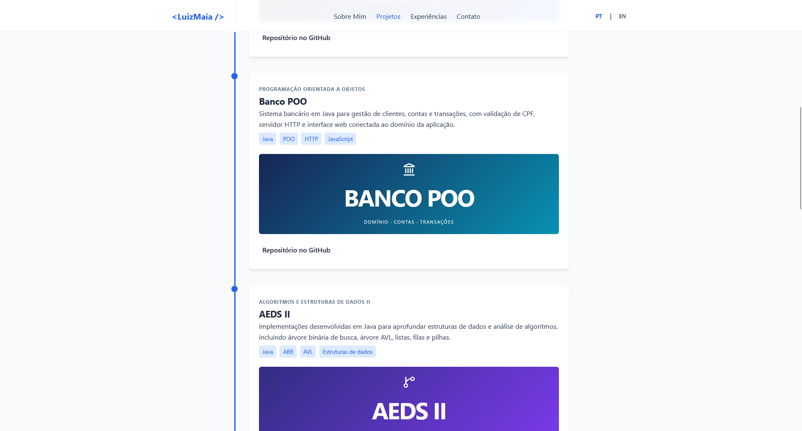
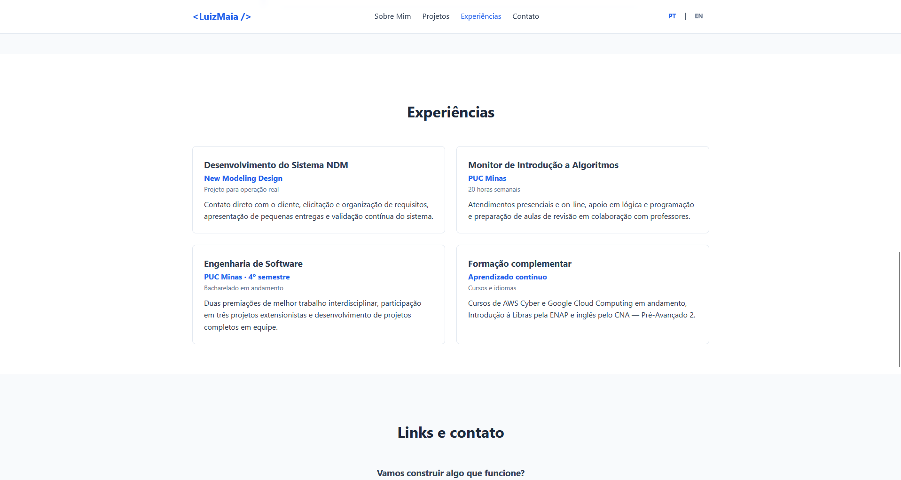
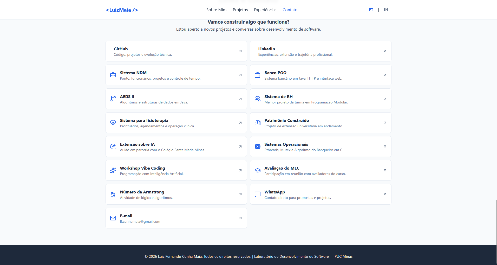

# Portfólio Profissional

Website de portfólio profissional responsivo, desenvolvido para a disciplina de Laboratório de Desenvolvimento de Software da PUC Minas.

## Integrantes

- Caio César Falinacio dos Santos
- Luiz Fernando Cunha Maia
- Pedro Henrique Nogueira Ferreira

## Tecnologias

- HTML5
- CSS3
- JavaScript
- Lucide Icons
- Vercel (hospedagem prevista)
- Figma (prototipagem)

## Estrutura de diretórios

```text
LABORATORIO-PORT/
├── assets/
│   ├── css/
│   │   └── style.css
│   ├── images/
│   │   └── projects/
│   └── js/
│       └── main.js
├── index.html
└── readme.md
```

As pastas `assets/images/` e `assets/images/projects/` estão preparadas para receber, respectivamente, a foto de perfil e as capturas dos projetos.

## Executando localmente

Abra o arquivo `index.html` no navegador ou use uma extensão de servidor local, como Live Server.

## WIREFRAMES


Nesse wireframe nos temos a vizao inicla do portifolio,um icone com as inicias que eu coloquei como nome do sistema,o nome,cidade e uma breve descrição alem disso,temos um header mostrando todas as telas desse portifolio e tambem a tradução para o ingles



Nesse wireframe temos os projetos,cards com as especificações de cada projeto,nome,descriçaõ,imagem e o valor que ele gera,para melhorar o caminahemnto pelo site tambem temos um "side - bar" que deixe o sistema mais armonico e condiz com a sua identidade vizual



Agora na parte de experiencias temos o que seriam cursos fora da faculdade ate mesmo alguns itens que estão em projetos serve para essa area,enfim nessa parte nos temos tambem uma breve descriçaõ sobre cada projeto realizado



Por ultimos nos temos a parte de links e contato do portifolio,onde o usuario consegue ter acesso direto ao contato do estudante e alguns links que achei util como repositorios,postagem me linkedin etcc......Também temos um rodape com preservaçaõ de direito e o nome da minha instituição PUC Minas e a disciplina que é Laboratório de Desenvolvimento de Software